# DevOps Design – UI + API + Database on AWS

## 📌 Overview

This repository contains a complete design-only DevOps architecture for deploying, securing, scaling, and maintaining:

- A *UI (frontend)* application  
- An *API (backend)* service  
- A *relational database*  
- A *CI/CD pipeline* using GitHub Actions  

This submission includes:

- **System Architecture Diagram (draw.io exported as PDF)**
- **CI/CD Pipeline Diagram (draw.io exported as PDF)**
- Infrastructure explanation
- Scaling strategies for UI + API
- Database HA + DR strategy
- CI/CD workflow description


---

## 🖼 1. System Architecture Diagram (Mermaid Version)

```mermaid
flowchart LR
    user([User Browser]) --> r53[Route 53 DNS]

    r53 -->|app.example.com| cf[CloudFront CDN]
    cf --> waf[AWS WAF]
    waf --> s3[S3 Bucket<br>(Static Frontend)]

    r53 -->|api.example.com| alb[Application Load Balancer]

    subgraph VPC
        subgraph Public_Subnets[Public Subnets (AZ1 & AZ2)]
            alb
        end

        subgraph Private_App_Subnets[Private App Subnets (AZ1 & AZ2)]
            ecs1[ECS Fargate Task<br>(API)]
            ecs2[ECS Fargate Task<br>(API)]
            secrets[AWS Secrets Manager<br>(DB Credentials, API Keys)]
        end

        subgraph Private_DB_Subnets[Private DB Subnets (AZ1 & AZ2)]
            rdsPrimary[RDS PostgreSQL<br>Primary (Multi-AZ)]
            rdsStandby[RDS Standby (AZ2)]
            rdsReplica[RDS Read Replica]
        end
    end

    alb --> ecs1
    alb --> ecs2

    ecs1 -->|fetch secrets| secrets
    ecs2 -->|fetch secrets| secrets

    ecs1 -->|TCP 5432| rdsPrimary
    ecs2 -->|TCP 5432| rdsPrimary

    rdsPrimary -. sync replication .-> rdsStandby
    rdsPrimary -. async replication .-> rdsReplica
```

---

## 🏗 2. Architecture Explanation

### 2.1 UI (Frontend)  
The frontend is designed as a **static SPA** (React/Angular/Vue) deployed using AWS serverless and globally distributed services.

#### Hosting
- Hosted in **S3** as static files (HTML, JS, CSS)
- Distributed via **CloudFront CDN**

#### Security
- S3 bucket is private; CloudFront uses **Origin Access Control**  
- **AWS WAF** (optional) protects against common attacks

#### Traffic Flow
User → Route 53 → CloudFront → S3  

#### Horizontal Scaling
- CloudFront scales globally
- S3 auto-scales
- Stateless SPA → infinite horizontal scalability

---

### 2.2 API (Backend)

#### Runtime
- Dockerized app
- ECS Fargate = serverless containers

#### Traffic Flow
Route 53 → ALB → ECS Tasks  

#### Security
- ECS tasks in **private subnets**
- Only ALB is public-facing
- Secrets in **AWS Secrets Manager**
- IAM Task Roles used to fetch secrets

#### Horizontal Scaling
- ECS Auto Scaling:
  - CPU > 60%
  - Memory > 70%
  - Requests-per-target threshold
- Multi-AZ tasks
- Rolling updates

---

### 2.3 Database (RDS PostgreSQL)

#### High Availability
- **Multi-AZ failover**  
- Primary + Standby

#### Scalability
- Vertical scaling  
- Read replicas  

#### Backups & PITR
- Automated backups  
- PITR available  
- Manual snapshots before migrations  

#### Schema Migrations
- Flyway/Liquibase/Prisma/Django migrations  
- Dev → Stage → Snapshot → Prod pipeline  

---

## 🚀 3. CI/CD Pipeline (Mermaid Version)

```mermaid
flowchart LR
    dev[Developer] --> repo[GitHub Repo]
    repo --> gha[GitHub Actions CI/CD]

    gha --> build[Build<br>- Frontend bundle<br>- Backend container<br>- Push to ECR]
    build --> test[Test<br>- Unit tests<br>- Linting<br>- Security Scan]

    test -->|merge to main| deployDev[Deploy to DEV<br>- S3 dev + CF invalidate<br>- ECS dev]

    deployDev --> devTests[Automated Tests on DEV]
    devTests --> approveStage{Manual Approval<br>for STAGE}

    approveStage --> deployStage[Deploy to STAGE<br>- S3 stage + CF invalidate<br>- ECS stage]
    deployStage --> stageTests[Smoke Tests on STAGE]

    stageTests --> approveProd{Manual Approval<br>for PROD}

    approveProd --> deployProd[Deploy to PROD<br>- S3 prod<br>- CF invalidate<br>- ECS update<br>- ALB health checks<br>- Rollback if fail]
```



---

## 🔄 4. CI/CD Workflow Explanation

### Triggers
- **PR:** build + tests  
- **Merge to main:** deploy to DEV  
- **Tag/approval:** promote to STAGE → PROD  

### Build Stage
- Build frontend  
- Build backend container  
- Push to ECR  

### Test Stage
- Unit tests  
- Linting  
- Security scans  

### Deployment
#### Frontend:
- Upload to S3  
- Invalidate CloudFront  

#### Backend:
- Update ECS task definition  
- ECS rolling deploy  
- ALB health checks  

### Promotion
DEV → STAGE → PROD  
With manual approvals.

### Rollback
- ECS rollback to previous task definition  
- Redeploy previous frontend artifact  

---

## ⚖ 5. How the System Handles Load

### Frontend
- CloudFront edge caching  
- S3 autoscaling  
- Browser caching  

### API
- ALB load balancing  
- ECS auto-scaling  
- Multi-AZ distribution  

### Database
- Read replicas for heavy reads  
- Multi-AZ failover  
- Vertical scaling when needed  

---

## 🛡 6. High Availability & Disaster Recovery

| Layer | HA Mechanism |
|-------|--------------|
| UI | CloudFront global CDN + S3 multi-AZ |
| API | ECS tasks across multiple AZs |
| Database | RDS Multi-AZ failover + replicas |
| DNS | Route 53 global DNS |

Backups:
- Automated backups  
- PITR  
- Snapshots  

---
